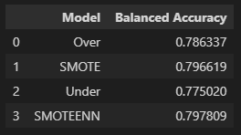
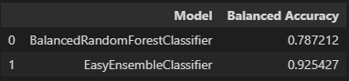
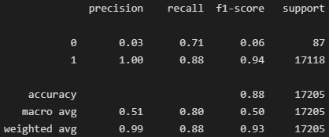
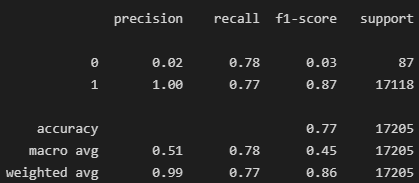
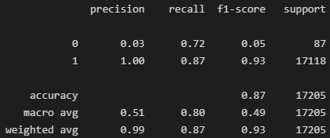
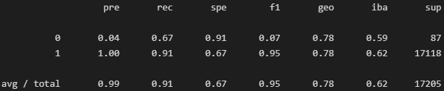
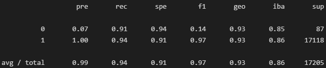
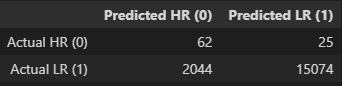
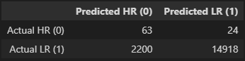
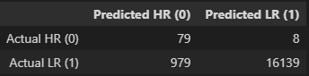

# Credit Risk Analysis

# Overview of the analysis

The purpose of this analysis is to create a machine learning model that can accurately identify loan applicants as high or low risk.

The challenge unique to this dataset is the occurance of high risk loan applicants is very low. This makes it difficult for any model to accurately predict and identify high risk applicants. 

To overcome this issue, 4 different sampling methods and 2 ensemble are applied to the modeling.

Throughout the analysis the following values are used to identify a loan applicants status:

0 = high risk,
1 = low risk

# Results

## Balanced Accuracy

### Sampling Methods

Of the sampling strategies, both SMOTE and SMOTEENN performed the best.

### Ensemble Methods

Of the ensemble methods, Easy Ensemble Classifier performed the best.

## Classification Reports

### Oversampling

### SMOTE 

### Undersampling

### SMOTEENN

### Balanced Random Forest Classifier

### Easy Ensemble Classifier

# Summary

The three best performing models by balanced accuracy are SMOTE, SMOTEENN, and Easy Ensemble Classifier. Of these three, SMOTE and SMOTEENN have F1 scores in high risk detection of 0.06 and 0.05 respectfully.

Both the SMOTE and SMOTEENN have senstivities of 0.71 and 0.72 for high risk. Given that high risk loan applicants are rare, these models could be useful. 

The best over all model was the easy ensemble classifier with an F1 of 0.14 for high risk loan applicants. 

A review all 3 confusion matrices are provided blow:

## SMOTE

## SMOTEENN

## Easy Ensemble Classifier

The model recommendation is based on the following assumption, the occurance of high risk loan applicants is very low. Therefore, the model should be baised towards approving more loans than denying loans.

The model that does that the best is the easy ensemeble classifier. It identifies most loan applicants as low risk. Also, its improved sensitivity to high risk improves its accuracy in detecting when a high risk occurs.

The number of false denials is greatly reduced. This helps reduce the work load on loan officers to manually evaluate loan denials to verify if the customer should be truly denied.

Recommended model is **easy ensemble classifier**.